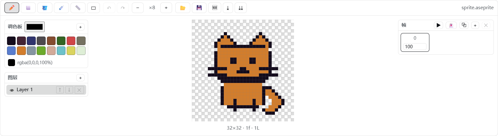
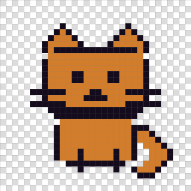
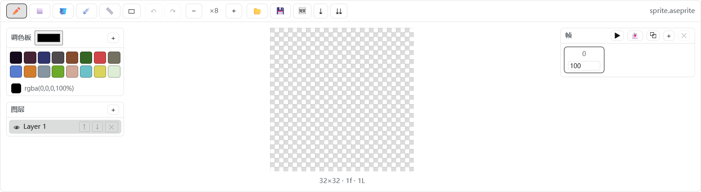

# dsh-aseprite

[English](README.md)

兼容 Aseprite 文件格式的像素画 / 精灵动画编辑器插件，运行在 DeepSeek Harness 的 Web GUI 中。

- 🎨 会话头部出现 **🎨** 按钮，点击展开/收起编辑器面板（停靠在输入框上方）。
- ✏️ 工具：铅笔 / 橡皮 / 油漆桶 / 取色器 / 直线 / 矩形 / 框选区域；支持撤销、重做、滚轮缩放、网格、洋葱皮、可调笔刷/橡皮大小，以及可拖拽左、右、上、下面板边界。
- 🤖 框选一部分后点击 **ASK**，输入局部调整要求；插件会把放大的选区 PNG 和坐标作为图片附件发给当前 DSH 会话 AI。AI 回复会留在对话中供确认，编辑器像素不会自动改写。
- 🧅 图层：新建 / 删除 / 上移 / 下移 / 显示隐藏。
- 🎞️ 帧动画：新增 / 复制 / 删除帧、每帧时长(ms)、播放预览。
- 🎨 调色板：内置 DB16 / PICO-8 风格 16 色调色板，可自定义颜色、追加色板、点击取色。
- 💾 读写 **.aseprite 工程文件**（纯 JS 实现，无需安装 Aseprite），支持 RGBA / 灰度 / 索引色读取与压缩 cel 解压；另支持导出当前帧 PNG 与整张 Sprite Sheet PNG。

## 演示



画布特写：



透明背景使用标准方形棋盘格：



## 原理

- **宿主端**（`lib/index.js`）：仅作为 loader 行存在，让 `dsh.client` 声明被扫描；编辑器本身 100% 运行在浏览器里。
- **客户端**（`client/client.js`）：遵循 `window.__ModuleLoader__.load({ id, factory })` 契约，通过 `ctx.slots` 注册到 `conversation.session.header.actions`（头部按钮）和 `conversation.input.dock`（停靠面板）。
- **编解码**（`src/ase-codec.js`）：按 [Aseprite 文件格式规范](https://github.com/aseprite/aseprite/blob/main/docs/ase-file-specs.md) 实现，写入 32bpp RGBA + raw cel + 新版调色板 chunk，Aseprite 可直接打开。

## 目录结构

```text
dsh-aseprite/
├── package.json        # dsh.bundle.patch + dsh.client 声明
├── README.md           # English documentation
├── README.zh-CN.md     # 中文文档
├── LICENSE
├── assets/             # GitHub 演示图
├── cordis.patch.yml    # loader 行：- id: aseprite, name: 'dsh-aseprite'
├── lib/index.js        # 宿主端（极简）
├── client/client.js    # 浏览器 bundle（构建产物）
├── src/ase-codec.js    # ASE 二进制编解码
├── src/editor.js       # 文档模型 + 绘制/图层/帧操作 + 导出
├── src/client.js       # React UI + apply()
└── scripts/build.mjs   # 零依赖构建脚本
```

## 开发 / 构建

```powershell
node scripts/build.mjs      # 重新生成 client/client.js
```

## 安装（本机）

已通过 `dsh plugin --profile web add` 安装。手动重装：

```powershell
# 将路径替换为本地插件目录；如无需显式 store-dir 可省略该参数
dsh plugin --profile web add --store-dir "<your-pnpm-store>" "file:<path-to-dsh-aseprite>"
```

装完后**重启 DeepSeek Harness**（关闭并重新打开），刷新页面，会话头部出现 🎨 按钮即成功。

## 卸载

```powershell
dsh plugin --profile web remove dsh-aseprite
```

并删除 profile `cordis.patch.yml` 里手写的 `aseprite` 条目（如有），重启应用。
